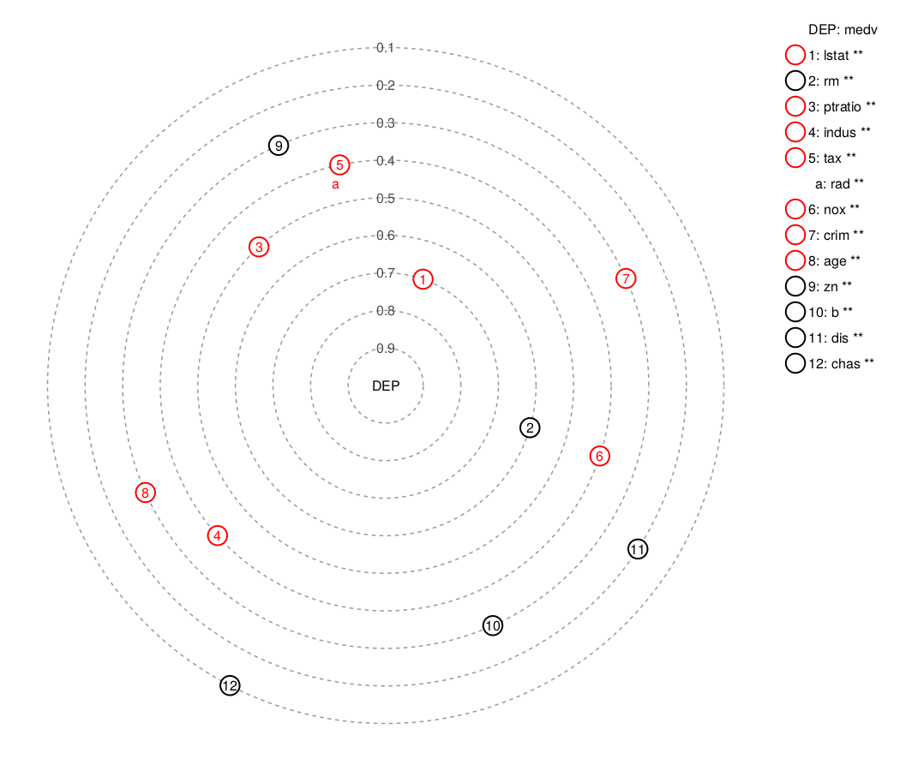

# Solar Correlation Map in Julia

## Overview
Visualize correlations between a given dependent variable and explanatory variables, as well as the intercorrelations between the explanatory variables, as a solar map.

The relationships between the dependent variable (the "Sun") and the explanatory variables (the "planets") are depicted as a solar system, where planets orbit around the Sun. The closer a planet is to the Sun, the stronger is their relationship, as indicated by a higher Pearson correlation coefficient.

Furthermore, some of these planets have their own moons. These moons represent explanatory variables that are closely related to the planet, with a correlation coefficient score over 0.8.

You can also regard the planets as the primary predictors (or main parameters) of the dependent variable and the moons as the colinear paramaters to the main parameters.

This work builds on [Stefan Zapf and Christopher Kraushaar's 2017 work](https://www.oreilly.com/content/a-new-visualization-to-beautifully-explore-correlations/) but differs in a few key ways. This work uses fewer colors in the graph, can display more explanatory variables through numerical representation, and tries to position markers to avoid overlap or excessive closeness.

## Usage
Clone the repo by

```
https://github.com/cbsteh/SolarCorrMap.git
```

The three important Julia source files are in the `src` folder. They are: `correlations.jl`, `drawmap.jl`, and `SolarCorrMap.jl`. The fourth file `main.jl` is an example file (see below).

## Example
Call the `viz` function to read the `CSV` data file, and plot the correlations as a solar map (see `main.jl`).

```
using SolarCorrMap

viz("data/housing.csv", :medv)
```

where `housing.csv` is a `CSV` file (in this case, the Boston Housing data), and `:medv` is the dependent variable in the provided `CSV` file.

The plot result is:



where negative correlations are denoted in red, else black for positive correlations. The legend on the left indicates the level of significance between the explanatory variables and the dependent variable, where `*` p<0.05, `**` p<0.01, and `ns` p>0.05.

## References
[O'Reily article. This article also explains the above example plot.](https://www.oreilly.com/content/a-new-visualization-to-beautifully-explore-correlations/)

[Python code by the original developers](https://github.com/Zapf-Consulting/solar-correlation-map)

[R code by yaricom](https://github.com/yaricom/solar-correlation-map-R)
